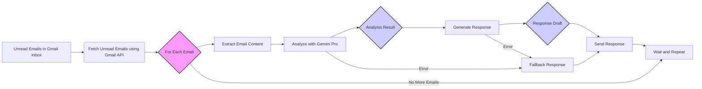
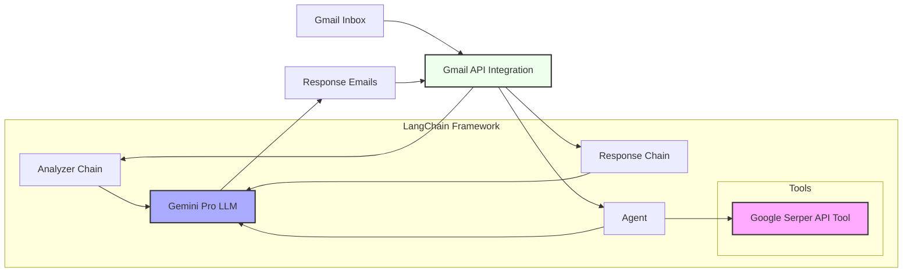

# Project Gemini-Inbox: Intelligent Gmail Assistant

[](https://www.repostatus.org/#active)

## Overview

**Project Gemini-Inbox** is an AI-powered Gmail assistant designed to intelligently analyze and respond to your emails, leveraging Large Language Models (LLMs). Built with LangChain and Google's Gemini Pro model, this project automates email management, helps prioritize important messages, and drafts personalized responses to boost inbox productivity.

## Conceptual Workflow



## Key Features

| Feature | Description | Benefit |
|---------|-------------|----------|
| Intelligent Analysis | Uses Gemini Pro LLM for content and sentiment analysis | Provides insightful email summaries and categorization |
| Personalized Responses | Generates contextually relevant replies | Saves time writing thoughtful responses |
| Web Search Integration | Optional Google Serper API for enhanced context | Enriches responses with current information |
| Error Handling | Robust handling of API and parsing failures | Ensures continuous operation |
| Gmail API Integration | Seamless email fetching and response | Automates entire email workflow |
| Customizable Prompts | Configurable LangChain prompts | Adaptable assistant behavior and tone |

## Technical Architecture



## Setup and Installation

1. Clone the repository
```bash
git clone [repository URL]
cd Project-Gemini-Inbox
```

2. Create and activate virtual environment
```bash
python -m venv venv
# Windows (PowerShell)
.\venv\Scripts\activate
# Linux/macOS/Git Bash
source venv/bin/activate
```

3. Install dependencies
```bash
pip install -r requirements.txt
```

4. Configure environment variables in `.env`:
```bash
GOOGLE_API_KEY=YOUR_GOOGLE_GEMINI_API_KEY_HERE
SERPER_API_KEY=YOUR_SERPER_API_KEY_HERE  # Optional
```

5. Set up Gmail API credentials:
   - Visit Google Cloud Console
   - Create/select project
   - Enable Gmail API
   - Create OAuth 2.0 credentials
   - Download `credentials.json` to project root

6. Run the application
```bash
python -u FinalCode.py
```

## Usage

1. Ensure virtual environment is activated
2. Run `python -u FinalCode.py`
3. First run will prompt for Gmail authentication
4. Assistant will process unread emails and generate responses
5. Check Gmail "Sent" folder for AI-generated responses

## Troubleshooting

| Error | Cause | Solution |
|-------|--------|----------|
| ModuleNotFoundError | Missing packages | Install required packages |
| ValueError: GOOGLE_API_KEY not found | Missing environment variable | Check .env file |
| ResourceExhausted: 429 | API rate limits exceeded | Implement delays between calls |
| JSONDecodeError | Invalid LLM output | Review prompts and error logs |
| Authentication Errors | Invalid Gmail credentials | Re-authenticate or check setup |

## Rate Limiting Considerations

- Implement delays between email processing
- Consider running periodically instead of continuously
- Optimize prompts for efficiency
- Use paid API plans for higher quotas

## Security Notes

- Never commit credentials to repositories
- Use environment variables for API keys
- Review Gmail API access permissions carefully
- Ensure compliance with privacy regulations

## Author

Siddharth Prakash (iamsid0011@gmail.com)
